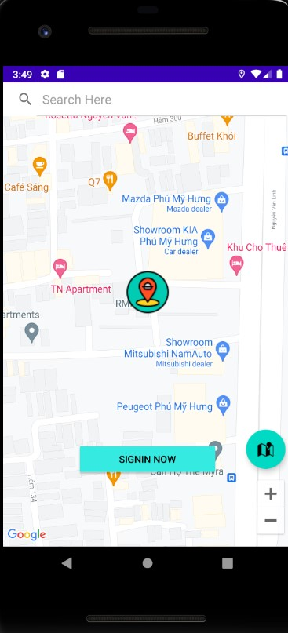

Course: COSC2657 - Android Development - Covid Testing Zone via Google Map  
Student: Nguyen Tran Phu - s3811248		   

--------------------------------------------
- App Name: Covid Testing Zone via Google Map  - RMIT App

--------------------------------------------
## Functionality of the App:
1. Signin/Signup/Signout:
- Userfriendly: Users can still see Map and Covid Zone Site on the app even when they are not signed in
 - Users can signup an account with their email, password, address, and name
- Users can signin an account with their email and password
- Users can signout after finishing registering Covid Testing Sites
2. Map Activity displays:
- Google Map
- Current Location
- Registered Covid Sites as a single item or a cluster of 2, 3 and 4
- Show them the best way to get to their sites - showing routes
3. Main Activity displays:
- Attended List for Covid Testing Sites
- Created List for Covid Testing Sites
- A Floating Button to create Covid Testing Site and become a leader (host) there
- A Floating Button to go back to Map Activity to select available Covid Testing Zones	
--------------------------------------------
## Technolgy used:
1. Firestore: to store the database of users and sites of the app.
2. Firebase Auth: signup/signin users by email and password
3. Google Map with enabling: Directions API, Maps SDK for Android, Places API, Geolocation API, Geocoding API
4./ Android Emulator: Pixel 2 API 28
--------------------------------------------
## Special action requirement:
1. Install Firebase
2. Google Map API
3. Enable Directions API, Maps SDK for Android, Places API, Geolocation API, Geocoding API in Google Console
4. Active Billing Account in Google Console to use Route Guiding
--------------------------------------------
## Bugs:
- UI is not designed perfectly due to the limited time.  
--------------------------------------------
## Reference:
- StackOverflow

# Demo
  
  
  
  
  
  
  
  
  
  
  
  
  
  
  
  
  
